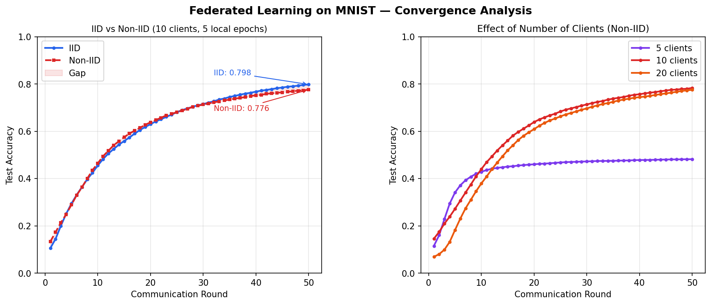

# Federated Learning from Scratch — MNIST

**Yousra Farrukh**  
BSc Artificial Intelligence, COMSATS University Islamabad  
KAUST VSRP Application — Prof. Peter Richtarik's 

---

## What I Built

I implemented federated learning from scratch to understand how it actually works mathematically. Everything is in NumPy — the neural network, the backpropagation, the optimizers, and the FedAvg aggregation. I did not use any deep learning framework or federated learning library.

The main question I wanted to answer: **what happens to convergence when clients have completely different data?**

---

## Results



| Experiment | Final Accuracy |
|---|---|
| IID — 10 clients | 79.8% |
| Non-IID — 10 clients | 77.6% |
| Non-IID — 5 clients | ~48% (plateaus) |
| Non-IID — 20 clients | ~78% |

The most interesting result was the 5-client case. With 5 Non-IID clients where each holds only one digit class, the model permanently plateaus at ~48%. It does not improve with more rounds. The reason is that 5 clients together only cover 5 of the 10 digit classes — the model never sees the other 5 during training so it cannot learn to classify them. More communication rounds cannot fix missing information.

---

## How Federated Learning Works

In normal machine learning you collect all the data on one server and train there. In federated learning the model goes to the data instead of the data coming to the model — so private data stays on each device.

The algorithm I implemented (FedAvg) works like this:

```
Start with a global model

For each round:
    1. Send global model weights to all clients
    2. Each client trains on their own private data locally
    3. Clients send back their updated weights (not the data)
    4. Server averages all the weights together
    5. That average becomes the new global model
    6. Repeat
```

The averaging step weights each client by how many samples they have:
```
new_global = sum( (client_samples / total_samples) * client_weights )
```

So a client with more data has more influence on the global model.

---

## Files

```
data.py        loads MNIST, splits it IID or Non-IID across clients
model.py       two-layer neural network — forward pass, backprop, all by hand
optimizers.py  SGD and SGD with Momentum, both from scratch
client.py      each client trains locally and returns weights
server.py      FedAvg aggregation
main.py        runs both experiments, makes the plots, prints the results table
```

---

## How to Run

```bash
pip install numpy matplotlib tensorflow
python main.py
```

tensorflow is only used to download the MNIST dataset. All the actual ML is NumPy.

---

## What I Implemented From Scratch

**Neural network (model.py)**

Two layers: 784 inputs → 128 hidden (ReLU) → 10 outputs (Softmax)

I used He initialisation for the weights because ReLU networks need it to avoid vanishing gradients at the start. The softmax subtracts the row maximum before the exponential — this prevents numerical overflow and does not change the output mathematically.

Backpropagation is derived by hand using the chain rule. The softmax + cross-entropy gradient has a clean form: the gradient at the output layer is just `predictions - true_labels`, which I find satisfying because it makes intuitive sense — the gradient pushes predictions toward the correct class.

**FedAvg (server.py)**

The weighted average across clients. Clients with more samples contribute more to the new global model. This is the core of the McMahan et al. 2017 paper.

**Optimizers (optimizers.py)**

SGD is the straightforward one. For momentum I used the standard form:
```
velocity = beta * velocity + (1 - beta) * gradient
weights  = weights - lr * velocity
```
The `(1 - beta)` part is important — without it the velocity is not a proper weighted average and the effective learning rate changes depending on what beta you choose.

---

## What I Found

The IID vs Non-IID gap (79.8% vs 77.6%) is real but smaller than I expected. This is because even though each client only has one digit class, 10 clients together still cover all 10 classes. So the global model eventually learns everything — it just takes more rounds and the conflicting gradient directions slow things down.

The 5-client case was more interesting to me. The plateau at ~48% is completely flat after about round 15 and stays there no matter how many more rounds you run. I initially thought this might be a bug but it makes sense — half the digit classes simply do not exist anywhere in the training federation.

The 20-client case starts slower than 10 clients in the first 10 rounds because each client has fewer samples (more noise per gradient update), but both end up around 78% by round 50.

---

## Limitations and Next Steps

This is a simple simulation — everything runs on one machine, all clients participate every round, and there is no network delay or communication cost. Real federated learning is messier.

The Non-IID gap I observed motivated me to read about FedProx (Li et al. 2020), which adds a term to each client's local loss that penalises drifting too far from the global model:

```
local_loss = cross_entropy(w) + (mu/2) * ||w - w_global||^2
```

This directly addresses the client drift problem. Implementing FedProx and comparing it to FedAvg on Non-IID data would be the natural next step.

---

## References

- McMahan et al. (2017) — Communication-Efficient Learning of Deep Networks from Decentralized Data
- Konecny, Liu, Richtarik & Takac (2016) — Mini-batch Semi-Stochastic Gradient Descent in the Proximal Setting
- Li et al. (2020) — Federated Optimization in Heterogeneous Networks (FedProx)
- Richtarik & Takac (2016) — Parallel Coordinate Descent Methods for Big Data Optimization
